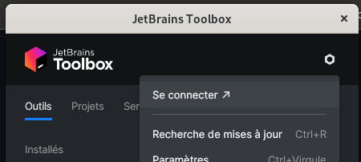
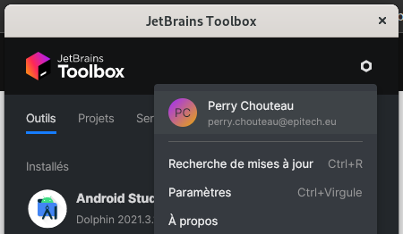
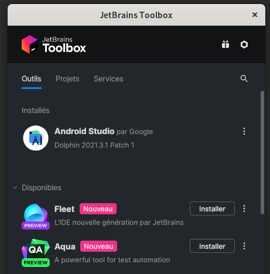
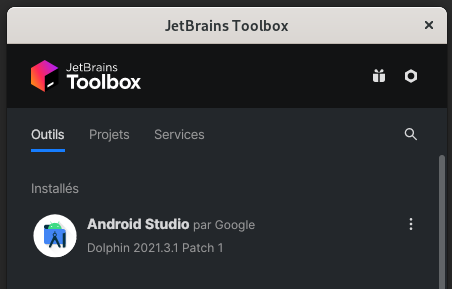
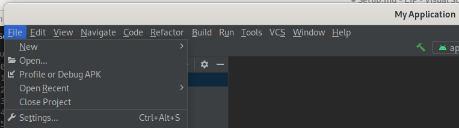
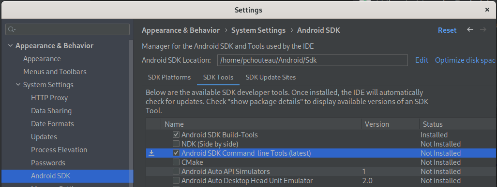
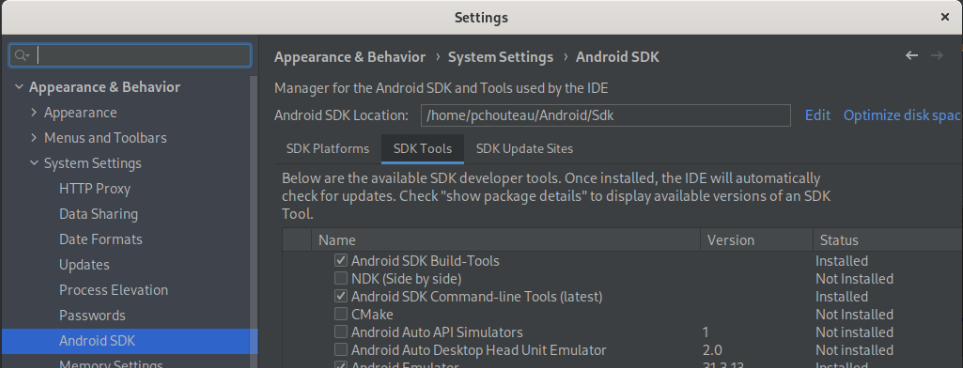

# [JetBrains Tool Box](https://www.jetbrains.com/)

- [Install it](https://www.jetbrains.com/fr-fr/toolbox-app/).
- Run `jetbrains-toolbox.`
- SignIn / SignUp to your account using Mail / Github(Free/Pro) account. (handle licences  mandatories)

    
    

- Search Android Studio and Install it.

    
    

# [Android Studio](https://developer.android.com/studio/docs/) (with jetbrains-toolbox):

Setup:

- Open Android Studio
- Open/Create Actual/New Project
- Go to File -> Settings -> Appearance & Behavior -> System Settings -> Android SDK

    

- Click on SDK Tools tab
- Select Android SDK Command-line Tools

    

- Click on Apply -> OK -> OK (optional confirm change) -> Finish buttons

    

# [Snapd](https://snapcraft.io/docs) (with snapd):

Description:

> A snap is a bundle of an app and its dependencies that works without modification across many different Linux distributions.

Setup:

- [Install it](https://snapcraft.io/docs/installing-snapd) on your linux distribution.

# [VSCode](https://code.visualstudio.com/docs) (with snapd):

Run `sudo snap install code --classic`.

# [Flutter](https://docs.flutter.dev/)

Setup:
> [Using fluter in China](https://docs.flutter.dev/community/china).
- Run `sudo snap install flutter --classic`
- Restart terminal
- Run `flutter doctor`
- If there are issues with `flutter doctor`, follow the instructions on the result of the command.

To install `Flutter` & `Dart` extensions on Android Studio:
- Go to `File -> Settings -> Plugins`
- Search for `Flutter` extension (it'll automatically install `Dart` extension)

# [Emulation](https://docs.flutter.dev/development/tools/android-studio)

This workshop is for mobile development, so you need a smartphone to see what you are doing.

To create a smartphone emulator:
- Open `Android Studio`
- Go to `Virtual Device Manager`
- Click on `Create device`
- Select a Device
- Choose an [`API`](https://docs.flutter.dev/development/tools/sdk/release-notes/supported-platforms)
- Then `Next` and `Finish`

---

| Last update    | JJ/MM/YYYY  |
| -------------- | ----------- |
| Perry Chouteau | 07/12/2022  |